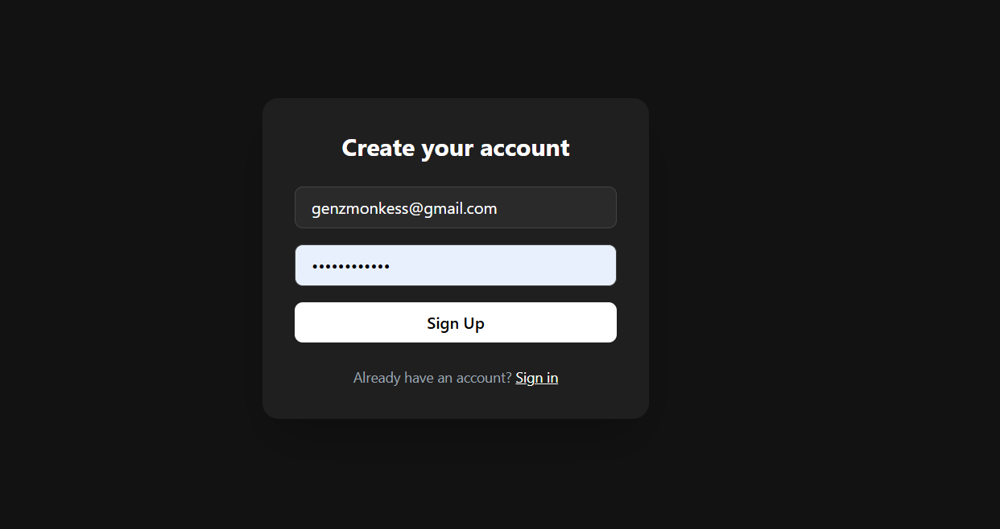
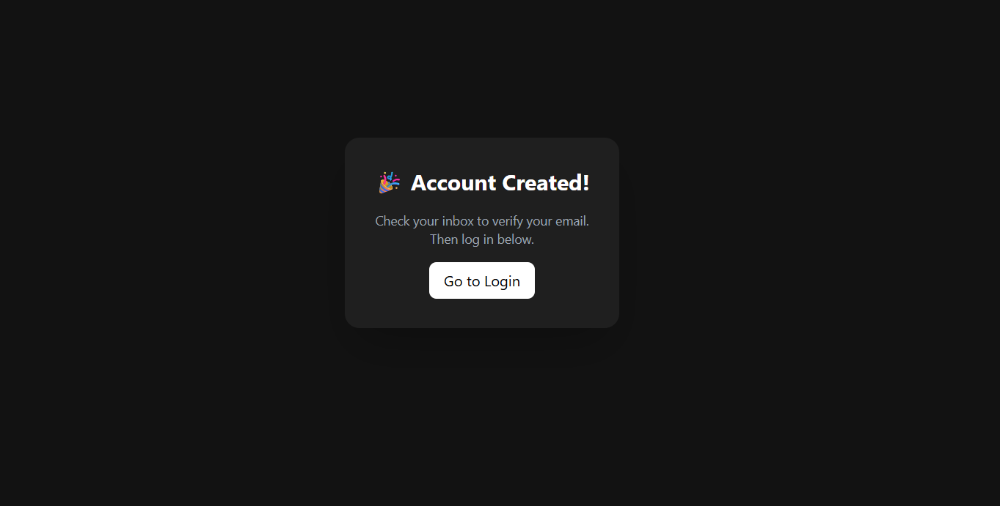
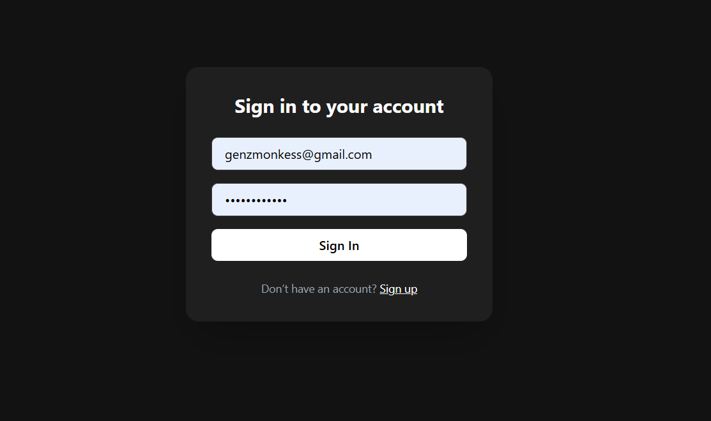
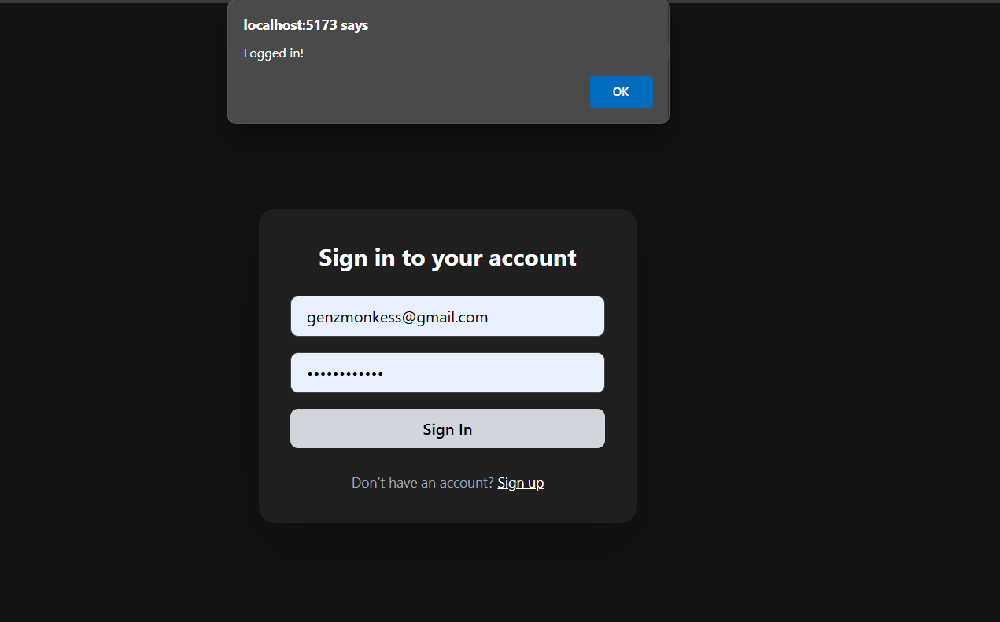
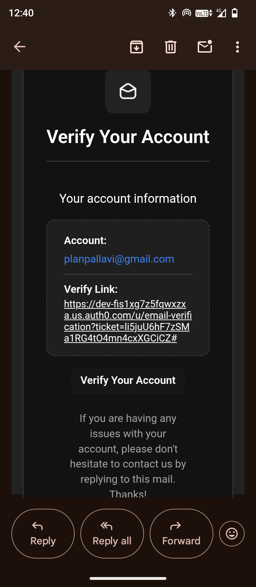
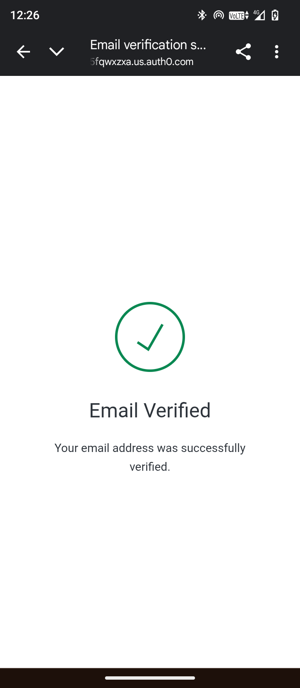
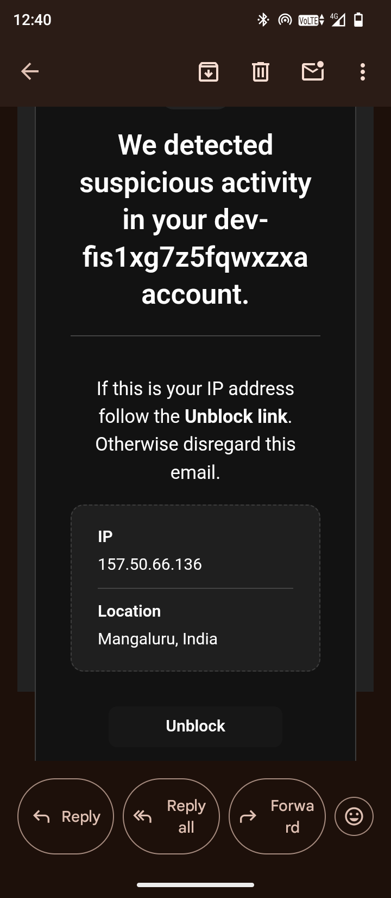

# 🚀 My Zero‑Redirect Auth0 Setup — Personal Cheat‑Sheet

> Hey future‑me (or whoever’s stalking my repo)… this is the **no‑BS, blow‑by‑blow journal** of how I got a fully custom email+password signup / login flow working with Auth0 **without ever touching their Universal Login page**.
>
> **Read top‑to‑bottom** when you need to rebuild from scratch. I’ve written *exactly* what I clicked, toggled, pasted, cursed at, and finally celebrated.  ✨🙌

---

## How it actually behaves once live

>
>
>
>

### 1. ✅ Email verification after sign‑up *(Auth0 out‑of‑the‑box)*

> After a user signs up (POST `/api/signup`), Auth0 auto‑fires an **email‑verification** message to the address they used.
> 
> The user must click the link in the email to activate their account. Only then can they log
> 


*What happens next?*

* User clicks the link → Auth0 marks `email_verified: true`.
* On next login the token will carry `email_verified: true` claim which I can read client‑side or in the backend.

### 2. 🔒 Suspicious‑login email (brute‑force / wrong‑password spam)

Auth0’s built‑in **Attack Protection** notices repeated bad passwords or logins from odd IPs.
When that triggers, Auth0 emails the account owner with a “Was this you?” alert.

> 

>

### Quick recap of the journey

1. **Signup** → `/api/signup` → user stored in DB → 📧 verification email.
2. **Login** (ROPG) → `/api/login` → Auth0 checks creds in `usersp` realm → returns JWT.
3. **Frontend** stores JWT → protected routes green‑lighted.
4. **Auth0 monitoring** watches for weird logins and pings the user if something smells fishy.

---


## Table of Contents (jump if you’re in a hurry)

1. [Why skip Universal Login?](#why-skip-universal-login)
2. [Auth0 dashboard steps](#auth0-dashboard-steps)
3. [.env — exact values](#env—exact-values)
4. [Backend code tweaks](#backend-code-tweaks)
5. [Front‑end reminders](#front‑end-reminders)
6. [Common errors & instant fixes](#common-errors--instant-fixes)
7. [Things “Past Me” wasted time on](#things-past-me-wasted-time-on)

---

## Why skip Universal Login?

* I wanted **total control over the UI** (fonts, shadows, weird gradients — mine, not Auth0’s).
* No redirect flicker. Everything stays `localhost:5173` (or prod domain).
* **Resource Owner Password Grant (ROPG)** is enough when:
  ‑ you trust your backend
  ‑ you only need email+password (no socials)
  ‑ you’re OK with rolling your own “Forgot Password” link later.

> ⚠️ **Security note:** ROPG is safe **only** if the secret lives on the backend. Never hit `/oauth/token` from the browser.

---

## Auth0 dashboard steps

### 0. TL;DR flowchart

```
Signup form → POST /api/signup → backend ⟶ Auth0 Management API → user created in DB connection
Login form  → POST /api/login  → backend ⟶ Auth0 /oauth/token (password‑realm) → tokens back
```

### 1. Create **Database Connection** (email‑only)

1. **Authentication → Database → + Create**
   *Name:* `usersp`  (I like the “p” so I know it’s *my* custom one)
2. Identifiers: **turn ON Email**, **turn OFF Username & Phone** → reason: Auth0 won’t nag for username.
3. Auth methods: **Password ON** (Passkeys off for now).
4. Hit **Create**.  ✅

### 2. Create **Machine‑to‑Machine App** for backend

1. **Applications → Applications → + Create Application**
   *Name:* `Custom Backend Auth (M2M)`  → type: *Machine‑to‑Machine*.
2. It auto‑lands in the “APIs” screen — choose **Auth0 Management API** → hit **Authorize**.
3. Tick ☑️ `create:users` + `read:users` scopes → Save.
4. **Advanced Settings → Grant Types**
   ☑️ **Client Credentials**
   ☑️ **Password**  → reason: we need client‑credentials for signup (Mgmt API) and password‑realm for login.
5. Copy **Client ID** + **Client Secret** → we shove these into `.env`.

### 3. Create a **Custom API** (this is *the* audience)

1. **APIs → + Create API**
   *Name:* `My Custom API`
   *Identifier:* `https://myapp.local`  (must be a URI string, but doesn’t need to resolve)
2. Leave RS256 → Create.
3. **Machine‑to‑Machine Applications tab** → authorize our **Custom Backend Auth (M2M)** app → tick any scope (I used `read:messages`).

🤔 *Why this step?* → Auth0 won’t issue an `access_token` for ROPG unless the `audience` matches a registered API **AND** the calling client is authorized.

### 4. Hook the DB connection to the app(s)

* Go to **Applications → Applications → Custom Backend Auth (M2M)** → **Connections** tab  → toggle **usersp ON**.
* Do the same for the SPA/web app if I ever use one.

### 5. (Optional) Disable username via Management API (only if GUI toggle is missing)

```bash
curl -X PATCH \
  -H "Authorization: Bearer <MGMT_API_TOKEN>" \
  -H "Content-Type: application/json" \
  -d '{"options": {"requires_username": false}}' \
  https://<AUTH0_DOMAIN>/api/v2/connections/<CONNECTION_ID>
```

---

## .env — exact values

Make `backend/.env` look like **this** 👇  (don’t commit the secret!)

```env
PORT=5000
FRONTEND_URL=http://localhost:5173

AUTH0_DOMAIN=dev-fis1xg7z5fqwxzxa.us.auth0.com
AUTH0_CLIENT_ID=p6Y8gfE6yiTN5osocnQxhwr0yDQB4YXq
AUTH0_CLIENT_SECRET=IQ5ORvo92uAbOSUV_0IQ0AkfuX99P1sLPR6XoxFMf9kBULwNaNPDHB2pfT3weXvt
AUTH0_AUDIENCE=https://myapp.local
AUTH0_REALM=usersp
AUTH0_SCOPE=openid profile email
```

*`AUTH0_REALM` = DB connection name. If I ever rename it, update here and in `server.js`.*

---

## Backend code tweaks

**server.js** key lines (already in repo):

```js
// LOGIN (ROPG)
await axios.post(`https://${AUTH0_DOMAIN}/oauth/token`, {
  grant_type: "http://auth0.com/oauth/grant-type/password-realm",
  realm: AUTH0_REALM,         // ← "usersp"
  audience: AUTH0_AUDIENCE,   // ← "https://myapp.local"
  ...
});

// SIGNUP (Management API)
await axios.post(`https://${AUTH0_DOMAIN}/api/v2/users`, {
  email,
  password,
  connection: AUTH0_REALM,   // ← "usersp"
  email_verified: false
});
```

---

## Front‑end reminders

* LoginCard.jsx sends `{ email, password }` to `/api/login`.
* SignupCard.jsx sends the same to `/api/signup`.
* Tokens currently stored in **localStorage** (fine for dev, switch to HttpOnly cookies in prod).

---

## Common errors & instant fixes

| Error                                         | Root cause                                       | How I cleared it                                                      |
| --------------------------------------------- | ------------------------------------------------ | --------------------------------------------------------------------- |
| *invalid audience specified…*                 | `AUTH0_AUDIENCE` not matching an authorized API. | Fix `.env` value **and** authorize M2M for that API.                  |
| *Missing required property: username*         | DB connection still demands `username`.          | Disable "Requires Username" **or** send `username: email`.            |
| *Client is not authorized to access…/api/v2/* | M2M app lacks Mgmt API scopes.                   | Dashboard → APIs → Auth0 Mgmt API → add `create:users`, `read:users`. |
| *Wrong email or password*                     | User record doesn’t exist in Auth0 or bad pass.  | Sign up first or reset pass in dashboard.                             |

---

## Things “Past Me” wasted time on

* Copy‑pasting the wrong **client\_id** (I used the SPA one by mistake 🤦‍♀️).
* Forgetting to toggle the DB connection ON for the new M2M app.
* Deleting the DB connection then wondering why my login broke.
* Typing the wrong realm in curl tests (`users` vs `usersp`).

---

### Final sanity test (manual curl)

```bash
curl -X POST https://$AUTH0_DOMAIN/oauth/token \
 -H "Content-Type: application/json" \
 -d '{
   "grant_type": "http://auth0.com/oauth/grant-type/password-realm",
   "username": "test@mail.com",
   "password": "Password123!",
   "audience": "https://myapp.local",
   "scope": "openid",
   "client_id": "'${AUTH0_CLIENT_ID}'",
   "client_secret": "'${AUTH0_CLIENT_SECRET}'",
   "realm": "usersp"
}' | jq
```

If that returns a JWT → 🎉 DONE.

---
